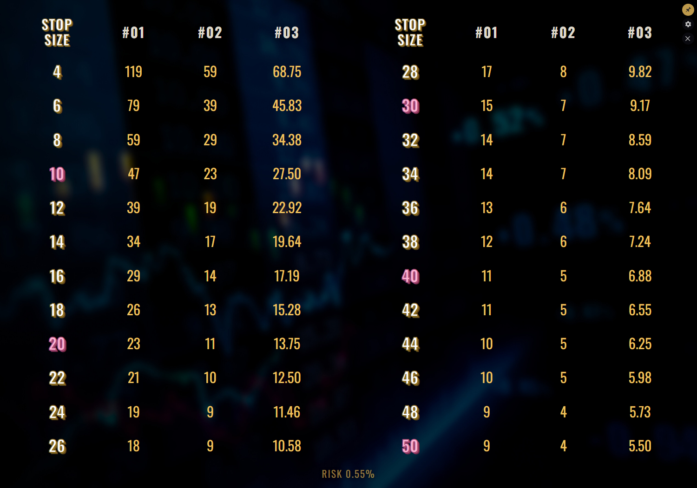

# Stop Size Widget

A resizable, always-on-top Windows widget that answers one question at a glance: for this stop
distance, how many lots should I go for? — across up to five trading accounts at once.

Built with [Tauri v2](https://tauri.app) — Rust backend, system WebView2 — and plain HTML/CSS/JS.
No framework, no bundler.



## Features

- 1 to 5 accounts, shown as `#01`…`#05`.
- Sizing as whole contracts or decimal lots with an optional hard cap, per account.
- Per-account instrument (based on EUR/USD, USD/JPY rates) and currency (USD, EUR, JPY).
- Both FX rates fetched once a day from keyless endpoints.
- Frameless, transparent, drag-from-anywhere, resizable — scales proportionally, never reflows.
- Always-on-top toggle, close-to-tray, tray restore/quit. Window state persists across restarts.

## Sizing

Risk is one percentage applied to every account: `risk = balance × risk_pct / 100`, in that
account's own currency. Converting it into a position size depends on the sizing convention:

```
contracts = TRUNC( convert(risk → instrument base) / stop )
lots      = MIN( ROUND( convert(risk → quote) / (stop × pip_value_per_lot), 2 ), max_lot )
```

Conversions between EUR, USD and JPY bridge through USD using the two cached rates, so any
currency/instrument pairing works.

`pip_value_per_lot` assumes a 10,000-unit lot — 1 USD for EUR/USD, 100 JPY for USD/JPY. If your
broker's lot convention differs, it's one constant in [`src/main.js`](src/main.js).

> **A lookup table, not a risk engine.** It knows nothing about spread, commission, slippage or
> open exposure, and the pip values are assumptions about your broker rather than facts fetched
> from it. Check the numbers against your platform.

## Exchange rates

Both pairs come from [frankfurter.app](https://frankfurter.app) (ECB daily reference rates),
falling back to [open.er-api.com](https://open.er-api.com). Neither needs an API key, so no
credential exists anywhere in the binary.

Fetching happens in Rust rather than the WebView, once a day per pair. Responses are
range-checked, and any failure silently keeps the cached rate.

## Config

`%APPDATA%\StopSizeWidget\config.json`, created on first run. Everything in it is reachable from
the settings panel.

The stop column is generated from `stop_range` rather than stored, and splits into two balanced
groups. Configs from earlier versions are migrated forward on load rather than discarded.

## Development

```bash
npm install
```

```bash
npm run tauri dev
```

Needs the [Tauri v2 prerequisites](https://tauri.app/start/prerequisites/): a Rust toolchain and
WebView2.

## Build

```bash
npm run tauri build
```

Produces `StopSizeWidget.exe` in `src-tauri/target/release/`. Unsigned, so SmartScreen warns once.

## Notice

All rights reserved — this repo is public to be read, not released, and no open-source license is
granted. See [NOTICE.md](NOTICE.md).
